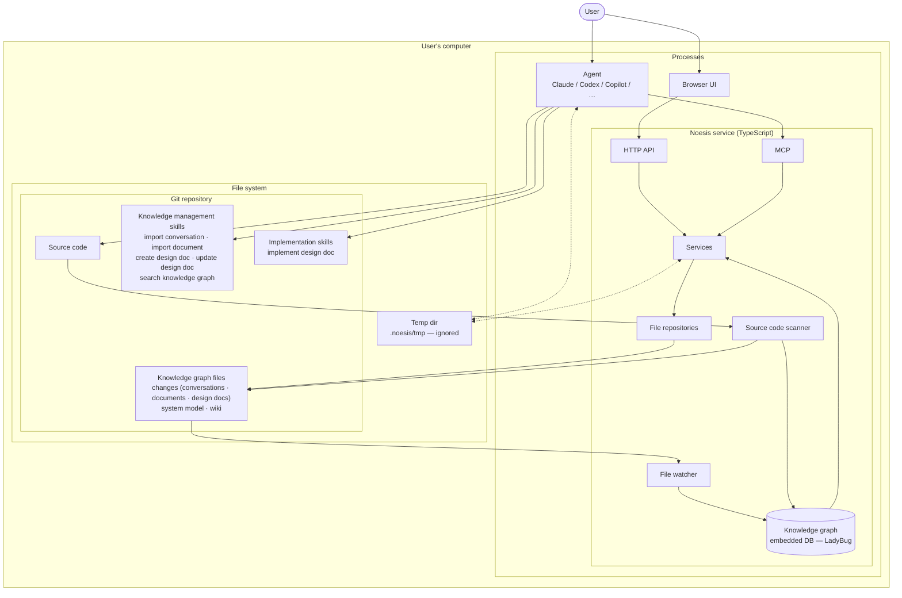

# Noesis — architecture

Target architecture. The flowchart below is the diagram. Decision D1 in
`docs/decisions.md` records the adoption, and D2 to D10 the points settled
after this document was written.

Noesis turns conversations and design drafts into a queryable knowledge graph, and drives
design and implementation work from it. Everything runs on the user's machine — there is no
server component and no network dependency.

## Overview



## Zones

**Processes** — the Noesis service, the agent, and the browser. Three separate processes on one
machine, sharing the filesystem. The service is a stdio MCP process started by the agent host,
one per agent session; it binds the HTTP API on an ephemeral port and opens the browser on it
once at boot. There is no long-running daemon: the UI exists while an agent session does, and
two sessions on one checkout are two processes over the same files.

**File system** — the shared medium the three processes communicate through. It holds the
**git repository** — the user's project, carrying the source code, the knowledge graph files
so that everything Noesis knows is versioned alongside the code it describes — and, ignored
from version control, the **temp dir** `.noesis/tmp/` used as scratch space between the agent
and the service. Skills are plugin content, versioned in the Noesis repository, not copied into
the user's project.

## Process model

The service is one process per agent session, started by the agent host as a stdio MCP server
(the plugin's `.mcp.json` launches `bunx @noesis-vision/noesis` with `NOESIS_ROOT` set to the
project). At boot it locates the repository (`NOESIS_ROOT`, else the nearest `.git` above the
working directory), ensures `.noesis/` and its `.gitignore`, opens its scratch directory under
`.noesis/tmp/`, builds the graph from the files, binds the HTTP API on an ephemeral loopback port,
opens the default browser on it once (`NOESIS_OPEN_BROWSER=0` suppresses this), and connects MCP
on stdio. stdout belongs to MCP; every log line goes to stderr. When the host closes the stream
the process removes its scratch directory, closes the database and exits — the UI lives exactly
as long as the agent session. There is no daemon, no browser-only mode and no shared process
between sessions; two sessions on one checkout are two processes over the same files.

## Entry points

Two, and only two.

- **Browser UI** reaches the service over an HTTP API. One endpoint per view; the service
  assembles each screen's payload server-side.
- **Agent** reaches the service over MCP. Tools are thin — parse arguments, call one service
  method, shape the response.

Both land on the same service layer. Neither bypasses it.

## Noesis service

- **Services** own use-case orchestration and view assembly. They are the only callers of
  repositories, and the only component both entry points can see.
- **File repositories** own the on-disk layout of the knowledge graph files — one repository per
  kind, each responsible for its own canonical paths and file format.
- **Knowledge graph** is an embedded in-memory database used as a cache over the JSON files in
  the repository. It is never authoritative: it is rebuilt from the files at every boot and
  nothing of it touches the disk.
- **File watcher** observes the knowledge graph files and re-indexes into the graph when they
  change — including changes Noesis did not make, such as a `git checkout` or a branch switch.
- **Source code scanner** reads the project source and projects the implemented model into the
  graph and into the system model files.

## Source of truth

**The files in the repository are the source of truth. The graph is a cache.**

This is the invariant the rest of the design follows from:

- Writes go to files first. The graph updates only as a consequence, through the watcher.
- The repository may change underneath the service at any time — git operations are a normal,
  expected source of change, not a failure case.
- The agent never writes knowledge graph files directly. It calls an MCP tool; the service
  validates, splits, and writes.
- Large payloads move through the **temp dir**, not through MCP. The agent writes its working
  file there and passes a path; results too large to inline are written there and the agent reads
  them back. MCP messages carry coordinates, not content. The MCP server's `instructions` name
  the repository root and the session's scratch directory, so no tool call is needed to find them.
- Writes are whole-file and atomic (write beside, then rename). When two agent sessions write the
  same entity, the last write wins and each process's watcher picks up the other's file; there
  are no locks and no hash preconditions.

## Knowledge graph files

All knowledge graph files live under `.noesis/` at the repository root, one directory per kind:

```
<project>/.noesis/
├── .gitignore            written by the service on first run; contains `tmp/`
├── tmp/<session>/        scratch space between the agent and the service — never versioned;
│                         one subdirectory per service process, removed when it exits
├── changes/              one directory per change tracked across the graph
│   └── <change>/         the change set itself, plus everything produced while working on it
│       ├── conversations/  imported conversation transcripts — turns and idea units
│       ├── documents/      imported documents — content, fragments, section tree
│       └── design-docs/    designed models, expressed as a diff against the implemented system
├── system-model/         the implemented model, projected from the source code by the scanner
└── wiki/                 the curated knowledge base, distilled from the imported sources
    ├── topics/           the topic tree — one file per topic, with summaries and item references
    └── decisions/        decisions with their options and supporting evidence
```

The split reflects provenance. `conversations/` and `documents/` are **imports** — a faithful
record of what was said or written, never rewritten. `wiki/` is the **distillate**: what the
imports mean, organised by subject rather than by source, and the part a person actually reads
and edits.

Imports and design docs are **scoped to a change**: a conversation is imported because some
change is being worked on, and a design doc describes that change. Keeping them under the change
directory makes the unit of work the unit of review — the whole record of a change lands in one
directory in a pull request. `system-model/` and `wiki/` are change-independent: the former
tracks the code as it is, the latter accumulates across every change.

The knowledge graph is `.noesis/graph/` (decision D2): one directory per object at every depth,
named by the object's key and holding exactly one `data.json`, written through a single typed
store. Rules that hold across every kind:

- **Store-managed only.** Under `graph/`, an object is a directory with a `data.json`; a
  directory without one is not an object, and nothing sits beside the data. Notes, source files
  and scratch space live outside `graph/` — `sources/`, `tmp/` — and are not graph content.
- **Directories nest by ownership, never by classification.** A change owns its conversations,
  documents and design documents, so those are child collections under
  `graph/changes/<change>/`; `system-model/` and `wiki/` are flat root collections. The topic
  tree lives in the data — a topic names its parent by id, a decision names its topic — so
  reparenting a topic is a one-field edit, not a file move.
- **The directory is the key.** A change's slug, the entity's id everywhere else. The service
  chooses the key; a `git diff` shows an id, and renaming an entity changes a field, not a path.
- **Stable ids.** Imported sources are identified by the hash of their content, so re-importing
  the same source yields the same id and is detected as a duplicate. Everything the graph
  authors itself gets a time-ordered id.
- **References are ids.** One object points at another by id. A fragment ref into an imported
  source also carries the hash of the source's JSON as imported; a source is never rewritten, so
  a differing hash means the ref was made against other content.
- **User edits are marked.** A field edited by a person is flagged as locked in the file itself.
  Skills preserve locked fields instead of overwriting them, and must ask before changing one.

Each file is self-contained and diff-friendly on purpose: the graph is reviewable in a pull
request, and a merge conflict lands in one entity rather than across the whole model.

## Schema contracts

Every knowledge graph file has a shape, and the agent authoring that file needs to know it. The
shapes are defined once, as Zod schemas under `shared-contracts/`, and that definition is the only
one — there is no second copy written in prose, and no generated mirror to keep in step.

**The agent reads the contract source from the plugin.** A skill names the contract it needs by a
path relative to the plugin root, and the agent reads that `.ts` file with its own file-reading
tool, at the step that produces the file and not before. Contracts do not travel over MCP at all:
they are static reference material with a known location, so a tool call to discover them would
buy nothing and add a round trip to every authoring step.

The service imports the contracts and bundles them into its executable, while the skills ship in
the plugin. A **build step copies the contract sources into the plugin**, which is what keeps the
path the skills reference stable regardless of how the package is installed or hoisted. The copy is
safe precisely because it is made at build time: it is deterministic, it ships in the same version
as the code it mirrors, and a test asserts it is byte-identical to the source it was copied from,
so the two cannot drift apart unnoticed. Each copy carries the package version in a header comment,
so a stale one is visible on sight. The `.ts` sources are published deliberately — compiled output
would keep the types and lose the `.describe()` text, which is the part worth reading.

The contracts are written to be read this way. They are declarative — object shapes, enums, and
change-set combinators, with no refinements, transforms, or imports beyond Zod itself — which
makes them self-contained and substantially cheaper to read than the equivalent expanded JSON
Schema. Fields carry `.describe()` text so the contract explains its own vocabulary.

What a schema cannot express stays in a companion document next to it: how to recognise
model-describing content in a draft, how to choose between change-set slots, and the conventions
that have no representation in the type. The schema is the shape; the companion document is the
meaning. Neither restates the other.

**Validation is the enforcement point.** In an interactive session nothing constrains what the
agent writes to disk, so the contract is guidance and validation is the guarantee. Validation is
its own MCP tool, callable against a working file before any write to the graph is attempted, and
the service validates again on write — a failed save is never how the agent discovers a shape
error.

Validation errors are written to be acted on rather than read: each one names the offending
location by path into the document, states what was expected against what was found, and gives a
single-line correction. That lets the agent edit the working file in place instead of
regenerating it. The error list is capped, reporting how many further problems were suppressed,
so one structural mistake does not bury the first real cause.

## Flow of a knowledge import

1. The agent runs a knowledge management skill, and reads the contract for the file kind it is
   about to produce from the plugin.
2. It writes its analysis to the temp dir.
3. It calls the validation tool with the working file path, corrects what comes back, and repeats
   until the file is clean.
4. It calls the matching MCP tool with the working directory path.
5. The service validates, splits the analysis, and writes the knowledge graph files through the
   repositories.
6. The watcher picks up the change and re-indexes the graph.
7. The UI and subsequent agent queries read the updated graph.

## Boundaries

- **No LLM in the service.** All semantic reasoning — topic search, summarisation, extraction —
  happens in the agent driving the skill. The service provides deterministic data access only.
- **No network.** Service, agent, browser, and repository are all local.
- **Skills live in the plugin**, versioned in the Noesis repository and shipped with the
  contracts they reference, so every project runs the same skills at the same version.
