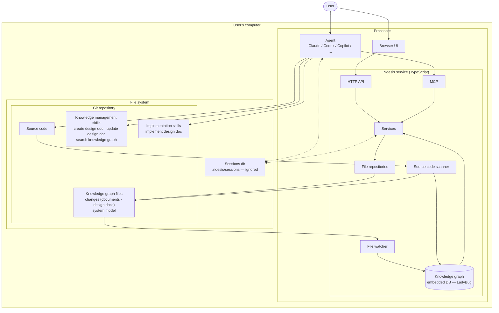

# Noesis — architecture

Target architecture. The flowchart below is the diagram.

**Not yet present:** the knowledge graph database, the file watcher and the source code scanner
are part of the target but not of the service today; they will be added in future. Until then,
services read the JSON files directly through the file repositories, and nothing indexes them or
writes `system-models/`.

Noesis turns documents and design drafts into a queryable knowledge graph, and drives
design and implementation work from it. Everything runs on the user's machine — there is no
server component and no network dependency.

## Overview



## Zones

**Processes** — the Noesis service, the agent, and the browser. Three separate processes on one
machine, sharing the filesystem. The service is a stdio MCP process started by the agent host,
one per agent session; it binds the HTTP API on an ephemeral port and opens the browser on it
once at boot. There is no long-running daemon: the UI exists while an agent session does, and
two sessions on one checkout are two processes over the same files.

**File system** — the shared medium the three processes communicate through. It holds the
**git repository** — the user's project, carrying the source code, the knowledge graph files
so that everything Noesis knows is versioned alongside the code it describes — and, ignored
from version control, the **sessions dir** `.noesis/sessions/` used as scratch space between the agent
and the service. Skills are plugin content, versioned in the Noesis repository, not copied into
the user's project.

## Process model

The service is one process per agent session, started by the agent host as a stdio MCP server
(the plugin's `.mcp.json` launches `bunx @noesis-vision/noesis` with `NOESIS_ROOT` set to the
project). At boot it locates the repository (`NOESIS_ROOT`, else the nearest `.git` above the
working directory), ensures `.noesis/` and its `.gitignore`, opens its scratch directory under
`.noesis/sessions/`, builds the graph from the files, binds the HTTP API on an ephemeral loopback port,
opens the default browser on it once (`NOESIS_OPEN_BROWSER=0` suppresses this), and connects MCP
on stdio. stdout belongs to MCP; every log line goes to stderr. When the host closes the stream
the process removes its scratch directory, closes the database and exits — the UI lives exactly
as long as the agent session. There is no daemon, no browser-only mode and no shared process
between sessions; two sessions on one checkout are two processes over the same files.

## Entry points

Two, and only two.

- **Browser UI** reaches the service over an HTTP API. One endpoint per view; the service
  assembles each screen's payload server-side.
- **Agent** reaches the service over MCP. Tools are thin — parse arguments, call one service
  method, shape the response.

Both land on the same service layer. Neither bypasses it.

## Noesis service

- **Services** own use-case orchestration and view assembly. They are the only callers of
  repositories, and the only component both entry points can see.
- **File repositories** own the on-disk layout of the knowledge graph files — one repository per
  kind, each responsible for its own canonical paths and file format.
- **Knowledge graph** _(not yet present)_ is an embedded in-memory database used as a cache over the JSON files in
  the repository. It is never authoritative: it is rebuilt from the files at every boot and
  nothing of it touches the disk.
- **File watcher** _(not yet present)_ observes the knowledge graph files and re-indexes into the graph when they
  change — including changes Noesis did not make, such as a `git checkout` or a branch switch.
- **Source code scanner** _(not yet present)_ reads the project source and projects the implemented model into the
  graph and into the system model files.

## Source of truth

**The files in the repository are the source of truth. The graph is a cache.**

This is the invariant the rest of the design follows from:

- Writes go to files first. The graph updates only as a consequence, through the watcher.
- The repository may change underneath the service at any time — git operations are a normal,
  expected source of change, not a failure case.
- The agent never writes knowledge graph files directly. It calls an MCP tool; the service
  validates, splits, and writes.
- Large payloads move through the **temp dir**, not through MCP. The agent writes its working
  file there and passes a path; results too large to inline are written there and the agent reads
  them back. MCP messages carry coordinates, not content. The MCP server's `instructions` name
  the repository root and the session's scratch directory, so no tool call is needed to find them.
- Writes are whole-file and atomic (write beside, then rename). When two agent sessions write the
  same entity, the last write wins and each process's watcher picks up the other's file; there
  are no locks and no hash preconditions.

## Knowledge graph files

All knowledge graph files live under `.noesis/` at the repository root:

```
<project>/.noesis/
├── .gitignore                  written by the service on first run; contains `sessions/`
├── sessions/<session>/         scratch space between the agent and the service — never versioned;
│                               one subdirectory per service process, removed when it exits
└── graph/
    ├── changes/
    │   ├── <change>.change.json       one change
    │   └── <change>/                  everything produced while working on it
    │       ├── <id>.document.json       an imported document — title, date and verbatim content
    │       └── <id>.design-doc.json     a designed model, as a diff against the implemented system
    └── system-models/
        └── <id>.system-model.json     the implemented model, projected from the code by the scanner
```

The split reflects provenance. Documents are **imports** — a faithful record of what was
written, never rewritten. Design docs are **authored**: what the
imports and the code are taken to mean for the change at hand, written by the agent with the
user, and revised in place as the design moves. `system-models/` is **derived**: the scanner
rewrites it from the source code, so nothing there is edited by hand.

Imports and design docs are **scoped to a change**: a document is imported because some
change is being worked on, and a design doc describes that change. Keeping them in the change's
folder makes the unit of work the unit of review — the whole record of a change lands in one
place in a pull request. `system-models/` is change-independent: it tracks the code as it is,
whichever change is in flight.

The knowledge graph is `.noesis/graph/`: one JSON file per entity, `<dir>/<id>.<kind>.json`,
read and written through one small collection class over one codec. Rules that hold across
every kind:

- **One shape.** Every entity, the change included, is a file named by its id and its kind. The
  change's file sits beside its folder, not inside it, so a change with no documents yet has no
  folder; the folder appears with its first child. A folder with no `.change.json` beside it is
  an orphan (a `git checkout` that removed the change): the change list never sees it, and no
  new child lands in it. Notes, source files and scratch space live outside `graph/` —
  `sources/`, `sessions/` — and are not graph content.
- **Folders nest by ownership, never by classification.** A change owns its documents and
  design documents, so those sit in `graph/changes/<change>/`; `system-models/` is flat. Where
  one object belongs under another by classification rather than ownership, the relation lives
  in the data as a field naming the other object's id, so re-classifying is a one-field edit,
  not a file move.
- **The file name is the key.** The entity's id names its file and repeats in its body; a
  mismatch is a validation failure, so a hand-renamed file never answers to two ids. Ids match
  `^[a-z0-9][a-z0-9-]*$`, so no id can name a path. A broken file fails the read that meets it,
  never silently answers as absent.
- **Stable ids.** Imported sources are identified by the hash of their content, so the same
  source imported twice lands under the same id rather than beside itself. A change, a document
  and a design document are keyed by a dated slug, `YYYY-MM-DD-<slug of its title>`
  (`2026-09-24-payment-retry`): the service mints it once, when the entity is created, and
  never re-derives it, so a retitled entity keeps its id. A title already used that day gets the
  next free suffix (`-2`, `-3`, …). A change id is unique among changes; a document or
  design-doc id only within its change. Ids sort by creation date.
- **Creates and updates are separate.** A working file never carries an id. A create tool mints
  one and answers with it, so two creates of one title make two entities; an update tool takes
  the id as an argument, replaces that entity whole and refuses an id that names nothing. No
  title or tracker key has to be unique.
- **References are ids.** One object points at another by id, never by path, and the same holds
  inside a file: the elements of a design document address each other by id, so renaming,
  reordering or reparenting an element leaves every reference to it intact.
- **User edits are marked.** Text a person wrote is recorded as such in the file itself — a
  design document marks the authorship of every piece of prose. Skills keep human-authored text
  exactly as it stands instead of overwriting it, and must ask before changing it.

Each file is self-contained and diff-friendly on purpose: the graph is reviewable in a pull
request, and a merge conflict lands in one entity rather than across the whole model.

## Schema contracts

Every knowledge graph file has a shape, and the agent authoring that file needs to know it. The
shapes are defined once, as Zod schemas in the feature folders under `server/backend/src/app/`, and that definition is the only
one — there is no second copy written in prose, and nothing kept in step by hand.

**The agent reads the contract from the plugin, as JSON Schema.** A skill names the contract it
needs by a path relative to the plugin root, and the agent reads that `.schema.json` file with its
own file-reading tool, at the step that produces the file and not before. Contracts do not travel over MCP at all:
they are static reference material with a known location, so a tool call to discover them would
buy nothing and add a round trip to every authoring step.

The service imports the contracts and bundles them into its executable, while the skills ship in
the plugin. A **build step generates JSON Schema from the Zod schemas into the plugin**, which is
what keeps the path the skills reference stable regardless of how the package is installed or
hoisted. The service owns the generation: it lists the contracts that ship, importing each schema
from wherever it lives, so nothing depends on a folder layout, and the plugin's build only says
where the files land. Only schemas ship: the domain objects defined next to them stay in the
service. The generated file is safe precisely because it is made at build time: it is
deterministic, it ships in the same version as the code it mirrors, and it is never committed, so
the two cannot drift apart unnoticed. Each file carries the package version in its `$comment`, so
a stale one is visible on sight. JSON Schema is larger than the Zod source, but it states each
shape whole — nothing to import, no `.omit()` or `.extend()` to resolve, a codec shown as the
string the agent writes — and it keeps the `.describe()` text, which is the part worth reading.
The larger contracts ship an example beside the schema, checked against it by a test.

The Zod schemas are written to be generated from. They are declarative — object shapes, enums, and
change-set combinators, with no refinements or transforms, which JSON Schema cannot state and would
drop silently; a test refuses them. Fields carry `.describe()` text so the contract explains its
own vocabulary.

What a schema cannot express stays in a companion document next to it: how to recognise
model-describing content in a draft, how to choose between change-set slots, and the conventions
that have no representation in the type. The schema is the shape; the companion document is the
meaning. Neither restates the other.

**Validation is the enforcement point.** In an interactive session nothing constrains what the
agent writes to disk, so the contract is guidance and validation is the guarantee. It happens
once, where the write happens: the tool that consumes a working file checks it against its
contract before the service sees it, and rejects the call having written nothing. There is no
separate validation tool — a pre-flight check would only run the same check twice and let the two
answers drift.

A rejection is returned in-band, as a result the agent can read: a list of issues, each naming the
offending location by path into the document with a message saying what is wrong there. The list
is capped, reporting how many further problems were suppressed, so one structural mistake does
not bury the first real cause. Working files and graph files are read by the same codec, so a
working file that passes is exactly what the graph would hold; the graph side adds only the check
that the file name matches the id.

## Flow of a write to the graph

1. The agent runs a knowledge management skill, and reads the contract for the file kind it is
   about to produce from the plugin.
2. It writes the document it has composed to the temp dir.
3. It calls the matching MCP tool with the working file path.
4. The tool validates the file. If it does not fit, the agent corrects what comes back and calls
   again; nothing was written.
5. The service writes the knowledge graph files through the repositories: at an id it mints
   for a create, at the id the tool was given for an update. It answers with the entity and its
   id.
6. The watcher picks up the change and re-indexes the graph _(not yet present)_.
7. The UI and subsequent agent queries read the updated graph.

## Boundaries

- **No LLM in the service.** All semantic reasoning — summarisation, extraction, deciding what a
  source means — happens in the agent driving the skill. The service provides deterministic data
  access only.
- **No network.** Service, agent, browser, and repository are all local.
- **Skills live in the plugin**, versioned in the Noesis repository and shipped with the
  contracts they reference, so every project runs the same skills at the same version.
